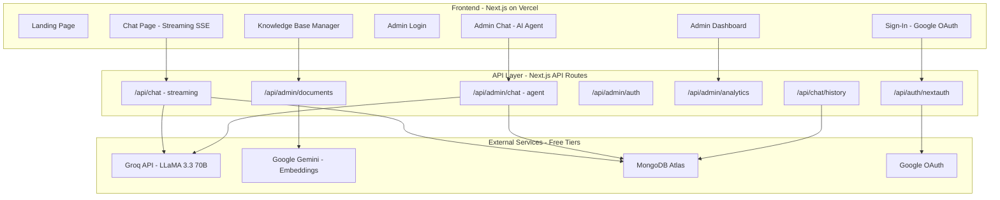
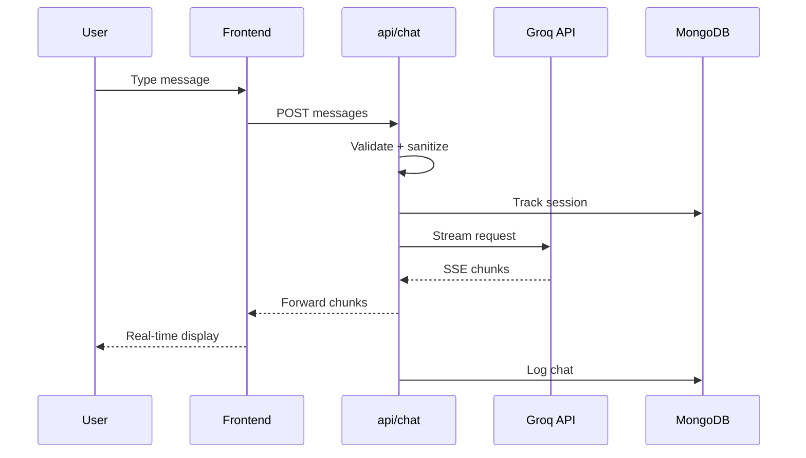

# ChotuBot — Product Requirements Document (PRD)

**Version**: 3.0 | **Date**: March 2026 | **Status**: Production  
**Live URL**: https://chotubot.vercel.app  
**Repository**: GitHub (private)

---

## Table of Contents

1. [Executive Summary](#1-executive-summary)
2. [Vision & Problem Statement](#2-vision--problem-statement)
3. [Target Market & Niche](#3-target-market--niche)
4. [Competitive Analysis](#4-competitive-analysis)
5. [System Architecture](#5-system-architecture)
6. [Technology Stack](#6-technology-stack)
7. [Feature Specifications](#7-feature-specifications)
8. [Database Schema](#8-database-schema)
9. [API Reference](#9-api-reference)
10. [Authentication & Security](#10-authentication--security)
11. [AI & RAG Pipeline](#11-ai--rag-pipeline)
12. [AI Agent & Function Calling](#12-ai-agent--function-calling)
13. [Frontend Architecture](#13-frontend-architecture)
14. [SEO & Marketing](#14-seo--marketing)
15. [Deployment & Infrastructure](#15-deployment--infrastructure)
16. [Environment Variables](#16-environment-variables)
17. [File Structure](#17-file-structure)
18. [Rebuild Instructions](#18-rebuild-instructions)
19. [Known Limitations](#19-known-limitations)
20. [Future Roadmap](#20-future-roadmap)

---

## 1. Executive Summary

ChotuBot is an **AI-powered customer support and admin intelligence platform** built for Indian D2C brands and small online businesses. It combines three capabilities into one $0-cost SaaS product:

1. **Customer-Facing AI Chat** — A streaming chatbot powered by Groq's LLaMA 3.3 70B model that answers customer queries in real-time
2. **RAG Knowledge Base** — Upload business documents (FAQs, return policies, product info); the AI answers FROM your data using Retrieval-Augmented Generation
3. **Admin AI Agent** — An intelligent agent with 8 function-calling tools that queries live MongoDB data via natural language ("how many users today?")

**Key Differentiator**: $0 infrastructure cost. Every service used operates on free tiers — Vercel (hosting), MongoDB Atlas (database), Groq (LLM inference), and Google Gemini (embeddings).

**Target Audience**: Indian D2C brands, Shopify/WooCommerce store owners, Instagram sellers, service businesses (1–20 person teams) who can't afford Intercom ($74/mo) or Freshchat ($19/agent/mo) but need 24/7 AI customer support.

---

## 2. Vision & Problem Statement

### The Problem

Indian small businesses face a critical customer support gap:

- **40–60% of support tickets** are repetitive queries ("Where is my order?", "What's your return policy?")
- **50% of SMBs have NO full-time IT staff** — the founder handles marketing, sales, AND support
- **78% of Indian consumers prefer WhatsApp/chat** over email for support
- Tools like Intercom ($74/mo), Freshdesk ($19/agent/mo), and Zendesk ($55/agent/mo) are unaffordable for businesses with ₹5L–50L revenue

### The Vision

> *"Train an AI on your business docs. It answers customer questions 24/7. You see what they ask. $0."*

ChotuBot empowers any small business owner to deploy an AI-powered support agent in under 10 minutes, with zero cost and zero technical knowledge required.

---

## 3. Target Market & Niche

### Primary Segment: Indian D2C & Small Online Businesses

| Segment | Size | Pain Point |
|---------|------|------------|
| D2C brands on Shopify/WooCommerce | $100B market by 2025 | High CAC, 25–30% return rate, repetitive queries |
| Instagram/WhatsApp sellers | 15M+ in India | No CRM, manual support, no analytics |
| Service businesses (salons, clinics) | 63M MSMEs in India | Same FAQs asked 100x/day, no digital presence |

### Market Data

- India's business messaging market: **>$1B by 2025**
- **60%** of Indian SMBs already use WhatsApp Business
- **80%** consider WhatsApp essential for operations
- **70%** plan to increase WhatsApp automation budget in 2026
- AI chatbot usage on WhatsApp in India has **quadrupled year-over-year**

### Why They'll Return

1. Chat history persists across sessions (Google OAuth)
2. Knowledge base gets smarter with every uploaded document
3. Admin insights reveal "most asked questions" — gold for product decisions
4. It saves 2–3 hours/day of answering the same questions

---

## 4. Competitive Analysis

| Feature | ChotuBot | Intercom | Freshchat | Tidio | CustomGPT | RAGBots |
|---------|----------|----------|-----------|-------|-----------|---------|
| **Price** | **$0** | $74/mo | $19/agent/mo | $29/mo | $99/mo | $9/mo |
| RAG Knowledge Base | ✅ | ❌ | ❌ | ❌ | ✅ | ✅ |
| AI Agent (function calling) | ✅ (8 tools) | ❌ | ❌ | ❌ | ❌ | ❌ |
| Streaming Responses | ✅ (SSE) | ✅ | ✅ | ✅ | ✅ | ✅ |
| Admin Analytics Dashboard | ✅ | ✅ | ✅ | ✅ | ❌ | ❌ |
| Self-hosted / Open Source | ✅ | ❌ | ❌ | ❌ | ❌ | ❌ |
| Google OAuth | ✅ | ✅ | ✅ | ✅ | ✅ | ❌ |

**Our Edge**: The AI Agent with function calling is genuinely unique at the $0 price point. No competitor offers natural-language database queries for free.

---

## 5. System Architecture



### Data Flow

1. **User sends message** → Frontend streams SSE request to `/api/chat`
2. **API validates** → Rate limit check → Input sanitization → Session tracking
3. **Groq LLM** generates streaming response → Words pushed via SSE → Frontend renders in real-time
4. **Session + chat logged** to MongoDB (non-blocking, fire-and-forget)
5. **Admin queries** trigger function calling → AI selects tool → Tool queries MongoDB → Results formatted

---

## 6. Technology Stack

| Layer | Technology | Purpose | Cost |
|-------|-----------|---------|------|
| **Framework** | Next.js 14 (App Router) | Full-stack React with SSR, API routes, middleware | $0 |
| **Language** | TypeScript 5.3 | Type safety, better developer experience | $0 |
| **Styling** | Tailwind CSS 3.4 | Utility-first CSS framework | $0 |
| **UI Components** | shadcn/ui (Button, Card, Badge) | CVA-based variant system with @radix-ui/react-slot | $0 |
| **Animation** | Framer Motion 11 | Page transitions, scroll animations, micro-interactions | $0 |
| **Icons** | Lucide React | Modern, consistent icon library | $0 |
| **LLM** | Groq (LLaMA 3.3 70B Versatile) | Chat completion, function calling, streaming | $0 (free tier) |
| **Embeddings** | Google Gemini (text-embedding-004) | Text to vector conversion for RAG | $0 (free tier) |
| **Database** | MongoDB Atlas (M0 Free Tier) | Document storage, vector search, user tracking | $0 |
| **Auth (Users)** | NextAuth.js 4.24 (Google OAuth) | User sign-in, JWT sessions | $0 |
| **Auth (Admin)** | Custom JWT (Web Crypto API) | Admin authentication with httpOnly cookies | $0 |
| **Hosting** | Vercel (Hobby Plan) | Serverless deployment, edge functions, CDN | $0 |
| **Fonts** | Google Fonts (Inter) | Modern typography | $0 |

**Total Monthly Cost: $0**

---

## 7. Feature Specifications

### 7.1 Customer Chat (Streaming)

- **Route**: `/chat` (🔒 **Auth required** — middleware redirects to `/auth/signin` if no session)
- **Model**: LLaMA 3.3 70B via Groq API
- **Streaming**: Server-Sent Events (SSE) — words appear in real-time like ChatGPT
- **Rate Limiting**: 20 messages per minute per IP
- **Input Sanitization**: Trim, 2000 char limit, null byte removal
- **Session Tracking**: IP-hashed sessions stored in MongoDB
- **Chat Logging**: Every message (user + AI) logged to MongoDB
- **Error Handling**: Graceful fallbacks for API failures, rate limits, network errors
- **UI**: Premium dark theme with violet/indigo gradients, glassmorphism

### 7.2 Admin Panel

- **Route**: `/admin` (protected by middleware)
- **Authentication**: JWT with httpOnly cookies, timing-safe password comparison
- **Dashboard**: Stats cards, chat volume chart (7 days), plan comparison
- **AI Agent Chat**: Natural language interface to query live data
- **Knowledge Base Manager**: Upload/delete text documents, auto-chunking + embedding

### 7.3 RAG Knowledge Base

- **Upload**: Plain text documents via admin panel
- **Processing Pipeline**:
  1. Text split into 500-char chunks with 50-char overlap
  2. Each chunk embedded via Gemini `text-embedding-004` (768-dim vectors)
  3. Chunks + embeddings stored in MongoDB `chunks` collection
- **Search Strategy** (3-tier fallback):
  1. MongoDB Atlas Vector Search — semantic similarity
  2. MongoDB Text Search — keyword matching
  3. Recent chunks fallback — return most recent 3 documents

### 7.4 AI Agent (Function Calling)

- **8 Tools** connected to live MongoDB queries
- **Iterative execution**: Up to 3 tool call rounds per query
- **Details**: See Section 12

### 7.5 Google OAuth (User Authentication)

- **Provider**: Google (via NextAuth.js)
- **Session Strategy**: JWT (no database sessions needed)
- **User Upsert**: On first sign-in, creates user in MongoDB `users` collection
- **Chat History**: Authenticated users get persistent chat history
- **Mandatory Auth**: `/chat` requires Google sign-in (middleware-enforced redirect). No anonymous access.

### 7.6 Landing Page

- **Sections**: Hero (BackgroundPaths SVG animation), Stats Bar, Features (6 cards), How It Works (3 steps), Pricing (Starter $0/Growth $29/Enterprise Custom), Testimonials (3 reviews), Trust Badges, FAQ Accordion (5 questions), Final CTA, Footer
- **Animations**: Framer Motion scroll-reveal (`useInView`), hover effects, animated SVG paths (36 flowing lines with violet/indigo gradient)
- **Auth**: All CTAs ("Get Started", "Sign In", pricing buttons) route to `/auth/signin`
- **SEO**: JSON-LD schemas, Open Graph, Twitter Card, sitemap, robots.txt

---

## 8. Database Schema

**Database Name**: `chotubot` (MongoDB Atlas M0)

### `documents` Collection
```json
{
  "_id": "ObjectId",
  "title": "string",
  "content": "string — full text content",
  "createdAt": "Date",
  "updatedAt": "Date"
}
```

### `chunks` Collection
```json
{
  "_id": "ObjectId",
  "documentId": "ObjectId — reference to parent document",
  "content": "string — 500-char text chunk",
  "embedding": "[number] — 768-dim Gemini vector",
  "chunkIndex": "number",
  "createdAt": "Date"
}
```

> [!IMPORTANT]
> Requires a MongoDB Atlas Vector Search index named `vector_index` on the `embedding` field. See Section 18.

### `sessions` Collection
```json
{
  "_id": "ObjectId",
  "sessionId": "string — SHA-256 hashed IP",
  "userAgent": "string",
  "path": "string",
  "firstSeen": "Date",
  "lastSeen": "Date",
  "visitCount": "number"
}
```

### `chats` Collection
```json
{
  "_id": "ObjectId",
  "sessionId": "string",
  "role": "string — user | assistant",
  "content": "string",
  "source": "string — user_chat | admin_chat",
  "toolsUsed": "boolean",
  "timestamp": "Date"
}
```

### `errors` Collection
```json
{
  "_id": "ObjectId",
  "path": "string",
  "error": "string",
  "statusCode": "number",
  "ip": "string — hashed",
  "timestamp": "Date"
}
```

### `users` Collection (Google OAuth)
```json
{
  "_id": "ObjectId",
  "name": "string",
  "email": "string",
  "image": "string — Google profile photo URL",
  "plan": "string — free | pro | enterprise",
  "lastLogin": "Date",
  "createdAt": "Date"
}
```

### `conversations` Collection (Chat History)
```json
{
  "_id": "ObjectId",
  "userEmail": "string",
  "userName": "string",
  "title": "string — auto-generated from first message",
  "messages": "[{role, content}]",
  "createdAt": "Date",
  "updatedAt": "Date"
}
```

---

## 9. API Reference

### Public APIs

| Method | Route | Description | Auth |
|--------|-------|-------------|------|
| POST | `/api/chat` | Streaming chat (SSE) | None (rate-limited) |
| GET | `/api/chat/history` | Get user conversations | Google OAuth |
| POST | `/api/chat/history` | Save/update conversation | Google OAuth |
| GET/POST | `/api/auth/[...nextauth]` | NextAuth endpoints | - |

### Admin APIs

| Method | Route | Description | Auth |
|--------|-------|-------------|------|
| POST | `/api/admin/auth` | Admin login | Credentials |
| DELETE | `/api/admin/auth` | Admin logout | JWT Cookie |
| POST | `/api/admin/chat` | Admin AI Agent | JWT Cookie |
| GET | `/api/admin/analytics` | Dashboard analytics | JWT Cookie |
| GET | `/api/admin/documents` | List knowledge docs | JWT Cookie |
| POST | `/api/admin/documents` | Upload knowledge doc | JWT Cookie |
| DELETE | `/api/admin/documents` | Delete knowledge doc | JWT Cookie |

### SSE Response Format
```
data: {"content":"Hello"}
data: {"content":" there!"}
data: [DONE]
```

---

## 10. Authentication & Security

### User Auth (Google OAuth)
- Provider: Google via NextAuth.js
- Session: JWT strategy (httpOnly cookie)
- Flow: Google consent → Callback → JWT issued → MongoDB upsert

### Admin Auth (Custom JWT)
- Password: SHA-256 via Web Crypto API
- Token: HMAC-SHA256 signed, 24h expiry
- Storage: httpOnly + Secure + SameSite=Lax cookie
- Middleware: Protects all `/admin/*` except `/admin/login`, and `/chat/*` (requires NextAuth session)

### Security Measures
- Rate Limiting: In-memory per-IP (20/min users, 30/min admin)
- Input Sanitization: XSS protection, length limits, null byte removal
- Timing-Safe Auth: Double SHA-256 hashing prevents timing attacks
- IP Hashing: SHA-256 before storage (privacy)
- Cookie Security: httpOnly, Secure, SameSite=Lax

---

## 11. AI & RAG Pipeline

### Chat Pipeline


### Embedding Model
- **Model**: `text-embedding-004` (Google Gemini)
- **Dimensions**: 768
- **Chunking**: 500 chars with 50-char overlap

---

## 12. AI Agent & Function Calling

8 tools connected to live MongoDB:

| Tool | Description | Parameters |
|------|-------------|------------|
| `count_users` | Count unique sessions | `hours_back` |
| `count_chats` | Count messages | `hours_back`, `source` |
| `top_users` | Most active users | `limit`, `hours_back` |
| `search_user` | Find user session | `query` |
| `get_errors` | Recent errors | `limit`, `hours_back` |
| `system_health` | System overview | none |
| `search_knowledge` | RAG search | `query` |
| `chat_history` | User chat logs | `session_id`, `limit` |

**Execution**: LLM selects tools → Execute against MongoDB → Results fed back → LLM responds. Up to 3 iterations.

---

## 13. Frontend Architecture

### Pages

| Route | Description |
|-------|-------------|
| `/` | Landing page with JSON-LD schema |
| `/chat` | Streaming chat UI |
| `/auth/signin` | Google OAuth sign-in |
| `/admin/login` | Admin JWT login |
| `/admin` | Admin dashboard + chat + KB |

### Design System
- Dark mode: HSL(240, 10%, 4%) background
- Primary: violet-500/indigo-600 gradients
- Glass: `backdrop-blur-xl bg-white/[0.02]`
- Font: Inter (Google Fonts)
- Animations: Framer Motion scroll-reveal + hover effects

---

## 14. SEO & Marketing

- Title, meta description, keywords (11 targeted)
- Open Graph + Twitter Card tags
- JSON-LD: SoftwareApplication + FAQPage schemas
- Sitemap (`app/sitemap.ts`) + robots.txt (`app/robots.ts`)
- Trust badges, testimonials, FAQ accordion, multiple CTAs

---

## 15. Deployment & Infrastructure

- **Vercel**: Hobby plan, auto-detected Next.js, serverless functions
- **MongoDB Atlas**: M0 free tier (512MB), network 0.0.0.0/0
- **Performance**: MongoDB connection caching, SSE streaming, non-blocking logging, dynamic imports

---

## 16. Environment Variables

| Variable | Description | Source |
|----------|-------------|--------|
| `GROQ_API_KEY` | Groq LLM API key | console.groq.com |
| `MONGODB_URI` | MongoDB Atlas connection string | Atlas Dashboard |
| `GOOGLE_CLIENT_ID` | Google OAuth client ID | Google Cloud Console |
| `GOOGLE_CLIENT_SECRET` | Google OAuth client secret | Google Cloud Console |
| `NEXTAUTH_SECRET` | JWT signing secret | `openssl rand -base64 32` |
| `NEXTAUTH_URL` | Production URL | `https://chotubot.vercel.app` |
| `ADMIN_PASSWORD` | Admin panel password | Your choice |
| `GEMINI_API_KEY` | Gemini embeddings API key | aistudio.google.com |

---

## 17. File Structure

```
chotubot/
├── app/
│   ├── layout.tsx              # Root layout (AuthProvider, SEO)
│   ├── page.tsx                # Landing page + JSON-LD
│   ├── globals.css             # Design tokens
│   ├── sitemap.ts / robots.ts  # SEO files
│   ├── chat/page.tsx           # Streaming chat UI
│   ├── auth/signin/page.tsx    # Google OAuth sign-in
│   ├── admin/login/page.tsx    # Admin login
│   ├── admin/page.tsx          # Admin dashboard
│   └── api/
│       ├── chat/route.ts       # SSE streaming chat
│       ├── chat/history/route.ts # Chat history CRUD
│       ├── auth/[...nextauth]/route.ts # Google OAuth
│       └── admin/
│           ├── auth/route.ts   # Admin JWT
│           ├── chat/route.ts   # AI Agent (8 tools)
│           ├── analytics/route.ts
│           └── documents/route.ts # RAG + KB
├── components/
│   ├── landing-page.tsx        # Landing page (BackgroundPaths, pricing, FAQ)
│   ├── auth-provider.tsx       # NextAuth wrapper
│   └── ui/
│       ├── background-paths.tsx # Animated SVG flowing paths
│       ├── button.tsx           # shadcn Button (CVA variants)
│       ├── card.tsx             # shadcn Card components
│       ├── badge.tsx            # shadcn Badge component
│       ├── particle-field.tsx   # Canvas particle system
│       ├── text-shimmer.tsx     # Gradient text animation
│       └── ai-voice-input.tsx   # Voice input component
├── lib/
│   ├── mongodb.ts              # Connection + caching
│   ├── auth.ts                 # JWT sign/verify
│   ├── security.ts             # XSS, timing-safe
│   ├── tracking.ts             # Session/chat/error logging
│   ├── embeddings.ts           # Gemini embeddings
│   └── utils.ts                # cn() utility
├── middleware.ts               # /admin + /chat route protection
└── package.json                # 12 prod + 7 dev dependencies
```

---

## 18. Rebuild Instructions

1. `git clone <repo> && cd chotubot && npm install`
2. Create MongoDB Atlas M0 cluster (allow 0.0.0.0/0)
3. Create vector search index on `chunks.embedding` (768-dim, cosine, name `vector_index`)
4. Get API keys: Groq, Gemini, Google OAuth
5. `npx vercel --prod`
6. Set all 8 env vars in Vercel Dashboard
7. Redeploy: `npx vercel --prod`
8. Test: landing page, chat, sign-in, admin login, upload doc, agent query

---

## 19. Known Limitations

| Limitation | Mitigation |
|-----------|------------|
| Vercel cold starts (2–3s) | MongoDB connection caching |
| Groq free tier rate limits | Error handling + retry UX |
| MongoDB M0 512MB | Monitor in admin panel |
| In-memory rate limiting resets | Upgrade to Upstash Redis |
| Plain text only for RAG | Add PDF/DOCX parsing |
| No WhatsApp integration | Planned Phase 8 |

---

## 20. Future Roadmap

**Phase 8**: Embeddable chat widget, WhatsApp Bot, Upstash Redis, PDF uploads  
**Phase 9**: Razorpay payments, multi-language (Hindi, Tamil), white-label branding  
**Phase 10**: Team accounts, API access, webhooks, sentiment analysis, A/B testing

---

*This PRD contains all information needed to understand, evaluate, rebuild, or extend ChotuBot. For investors: the $0 cost model is verified and sustainable. For developers/Cursor: every file, API, schema, and configuration is documented.*
